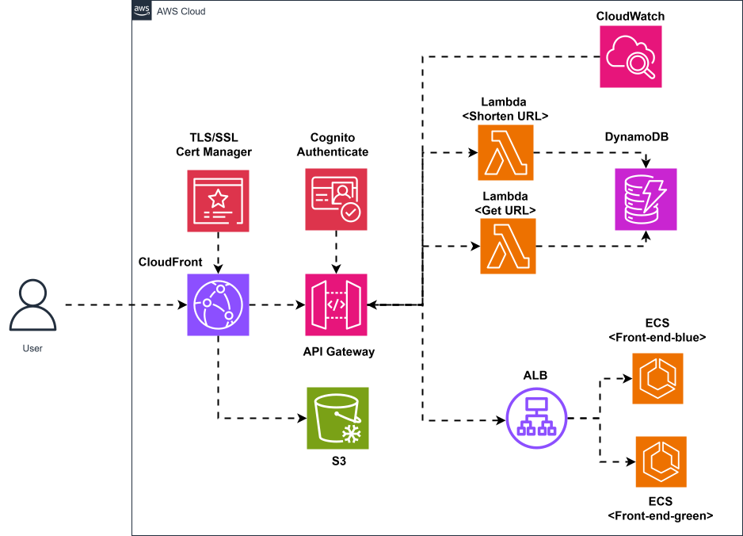

# AWS-Serverless-02-ApiGatewayLambdaCognitoAuth


### Architure Design


### Implement step

- Step 1: Create UrlShortenTable in AWS DynamoDB
    - Option 1: Using AWS Console
        - Go to AWS DynamoDB Console
        - Click “Create table”
        - Enter the following:
            - Table name: UrlShortenTable
            - Partition key:
                - Name: short_url
                - Type: String
        - Leave the rest as default (on-demand capacity is fine for testing).
        - Click “Create table”

    - Option 2: Using AWS CLI

    ```
    aws dynamodb create-table \
        --table-name UrlShortenTable \
        --attribute-definitions AttributeName=short_url,AttributeType=S \
        --key-schema AttributeName=short_url,KeyType=HASH \
        --billing-mode PAY_PER_REQUEST \
        --region ap-southeast-1
    ```


- Step 2: Setup Lambda Function for backend
    - Select `Author from scratch`
    - Create new function with name `AWS-Serverless-02-generate-short-url-func`
    - And past the code backend from `repos/AWS-Serverless-02-shorten-link-backend/generate_short_url/app.py`
    - Choose runtime `Python 3.9`
    - Choose `Create a new role with basic Lambda permissions`
    - Click on Create Functions
